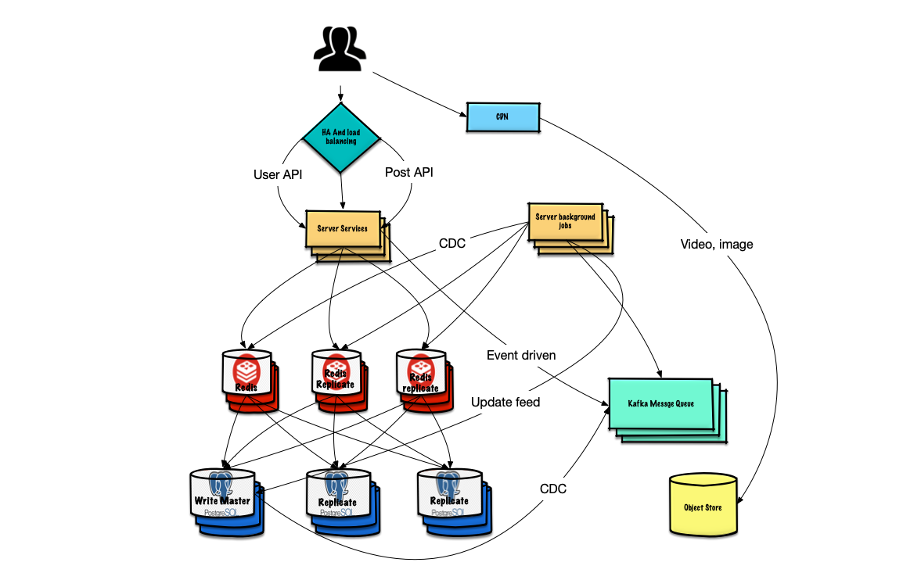

### Problem
Design a simple model of Facebook where people can add other people as friend. In addition, where people can post statuses and that statuses are visible on their friend's feed. The design should be such that it can handle 10M of people. There may be, on an average 100 friends each person. Everyday each person posts around 10 status on an average.

### Clarify the problem
everything is clear

## Design
#### endpoints
+ /friend/add
	<table>
	<tr><td>

	|				user 				|
	|-------------------|
	| id uuid						|
	| name varchar			|
	| phone	varchar			|
	|	email varchar			|
	| password SAH265		|

	</td><td>

	|			friend				|
	|-------------------|
	| user_id uuid			|
	| friend_id uuid		|

	</td></tr></table>

+ /post/create

	<table>
	<tr><td>

	|			post					|
	|-------------------|
	| id uuid						|
	| user_id uuid 			|
	|	content	longtext	|
	| created_at datetime 	|
	| updated_at datetime 	|

	</td><td>

	|			feed					|
	|-------------------|
	| id uuid						|
	| post_id uuid 			|

	</td>
	</tr></table>

+ /post/listing

#### Tools

+ Use SQL Dabatabase (RDBMS):
	Assume that I choose PostgreSQL to store user and post
+ Use key-value Redis for cache layer
+ Use Kafka as message queue containing event messages

#### System architecture

#### Bottleneck and trade-off
+ the diagram show that bottelneck maybe happen at HA/Load balancing.
+ using multi rerplicates model helps to read faster, but it can lead to write slower because time was spent to copy data to other replicates. Moreover, inconsistent data can happen between leader and follower replicates.
