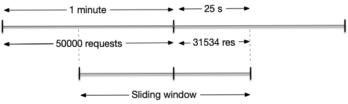

### Rate Limit System
#### Problem: 
Because of infinite resouces and for secure issues we want to limit the number of request per unit time per user to our services. We will build a system , which can count the total of request of user per unit time and when this number reaches a threshold the next request will be refused, to address this problem.
Nowadays, there are many algorithms used to deal with this issue like **fixed window**, **sliding log**, and **sliding window**. Each these method has their own benefits and downsides.

#### Sliding window algorithms
Sliding window is algorithms allowing us to calculate approximate number of requests at the time on a sliding window. Although It not give a precise number of requests, It help we to cope with disadvantages of fixed window and sliding log like bursting boundar or need a lot of space for storaging logs. Moreover sliding window have good scalability.

#### Clarify sliding window algorithms

Window threshold is: 55000 requests per window
Window side: 1 minute
On a previous window the service received 50000 requests
At 25 th second of current window we counted 31534 request which the service received

How we can decide to whether the total of retuests exceed the threshold or not?
To do that we need to calculate the number of requests on the sliding window which start from the 25th second of previous window to 25th second of current window.
Therefore we have a fomular to compute the approximate number of requests: 

**res = (50000/60) x 35 + 31534 = 60700** requests greater than 55000.

It is apparent that total of requests beyond the threshold, so the requests come to the sliding window will be denied to serve.

### System architecture

Following the above fomular we need to storage the number of request on the previous window and current window.
I will choose the key-value database for this case and because these data read a lot of times in every request, so we need to cache these figure.
I think Redis and Scylla DB or Cassandra are suitable for this situation. I am going to use Redis as memory db and Scylla for persistent data, but in this case, I only use redis and do not need
to storage permanent data because this data is not important. Our system can lose this data when Redis cluster down, but it is ok. I will take the risk. 

Because the window size is 1 minute thus the key of data looklike **minute-timestamp:user-IP** and obviously, the values are a number of requests. You can design rate limiting on many level: global, network, http so on. In this article I just mention global user-IP level for a service.

Nowadays, Microservices architecture is very popular, so a service will has many replication and one replication can handle parallel requests at the same time for scalability purpose. Every request needs to call rate limiter to check total of requests. It means this system will be able to handle a huge requests at the same time. 
Moreover, it is apparent that we need a global request counting, so we will centralize storage and in this case, we use Redis storage. It easily lead to the rate limiting system will be bottle-neck or and not scale well. 
We maybe have to scop with some challenges.

#### Challenges

On every user request we have to update the number of requests for users, so It needs to resolve **Race Conddition** problem which means that updating users' total requests has to an atomic operation.
Because our rate limiting system have to handle a lot of request if it is slow, our sevice latency will be increased significantly. We must optimize it to response on less than 0.1 second.

#### Solutions

To address the Race conddition problem we need to synchonized update number of requests or in other words we will use an atomic operation to update this figure. If we use Redis for storaging It's operation **SET** is already an atomic operation.
We have may way to deal with hotspot and optimize latency of rate limiter system. In this article, I suggest an approach, which we will storaging the number of requests of every user on local replication service and push them to database after interval time. This interval time can config short or long depending on your practical resource and demanding.
